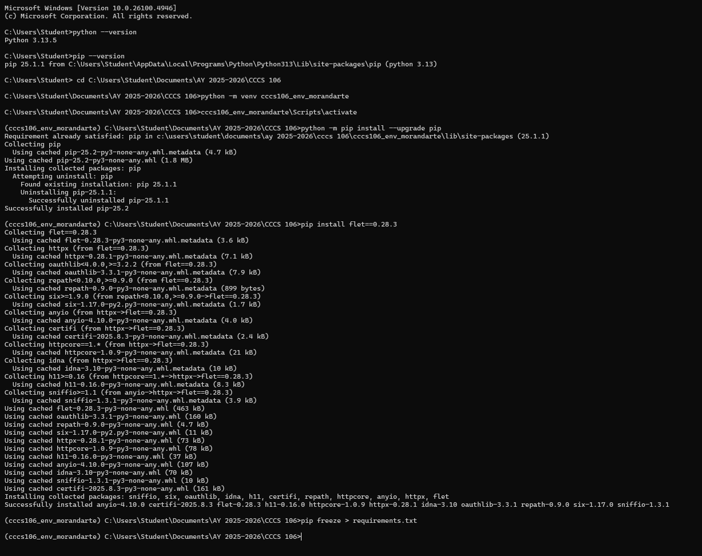
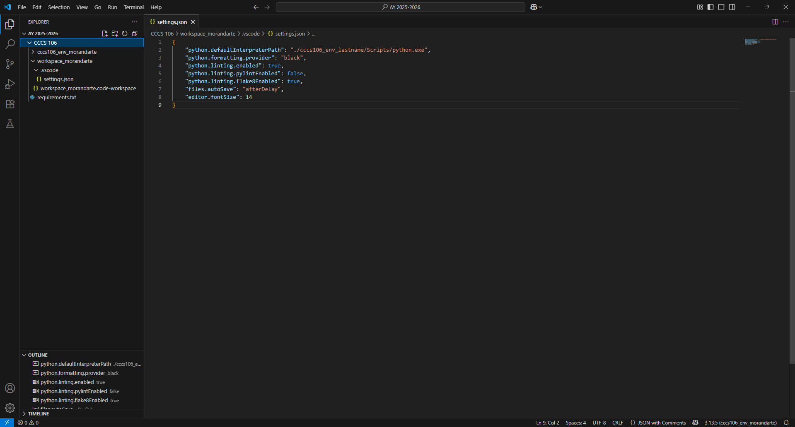
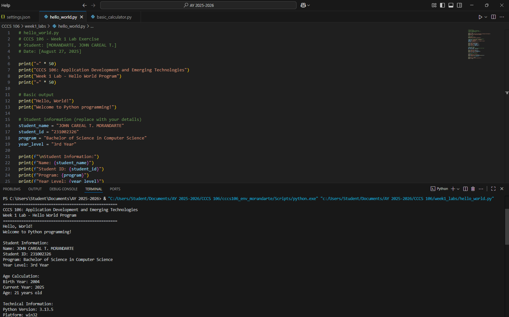
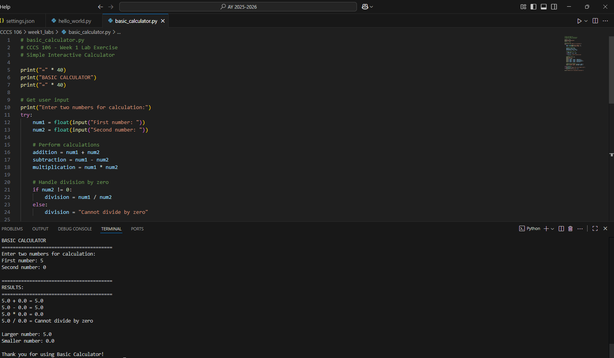

# Lab 1 Report: Environment Setup and Python Basics

**Student Name:** JOHN CAREAL T. MORANDARTE\
**Student ID:** 231002326\
**Section:** BSCS 3A\
**Date:** AUGUST 27, 2025

## Environment Setup

### Python Installation
- **Python Version:** 3.13.5
- **Installation Issues:** There is no any problem in installing the python, because python is already installed in a required version
- **Virtual Environment Created:** ✅ cccs106_env_morandarte

### VS Code Configuration
- **VS Code Version:** 1.103.2
- **Python Extension:** ✅ Installed and configured
- **Interpreter:** ✅ Set to cccs106_env_morandarte/Scripts/python.exe

### Package Installation
- **Flet Version:** 0.28.3
- **Other Packages:** requirements.txt

## Programs Created

### 1. hello_world.py
- **Status:** ✅ Completed
- **Features:** Student info display, age calculation, system info
- **Notes:** It runs smooth and doesn't have any error

### 2. basic_calculator.py
- **Status:** ✅ Completed
- **Features:** Basic arithmetic, error handling, min/max calculation
- **Notes:** runs smoothly without any error

## Challenges and Solutions

I have a hard time to select the correct interpreter, but i just re-do it and it was successful in 2nd try

## Learning Outcomes

I learned how to select the correct interpreter and I learned how to manage folders

## Screenshots

