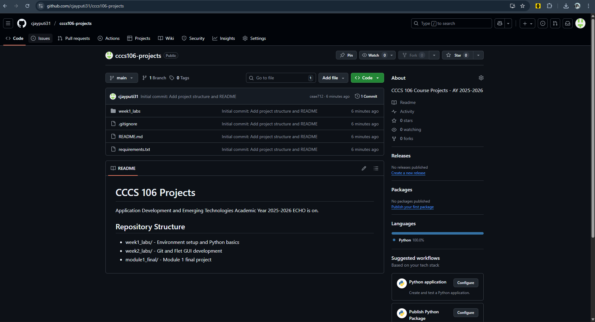
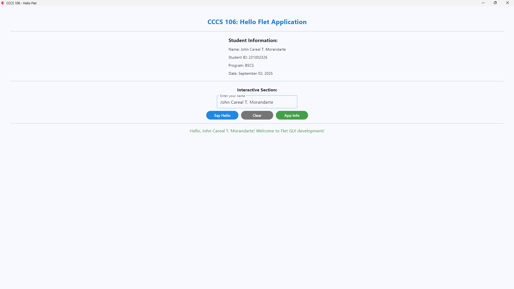
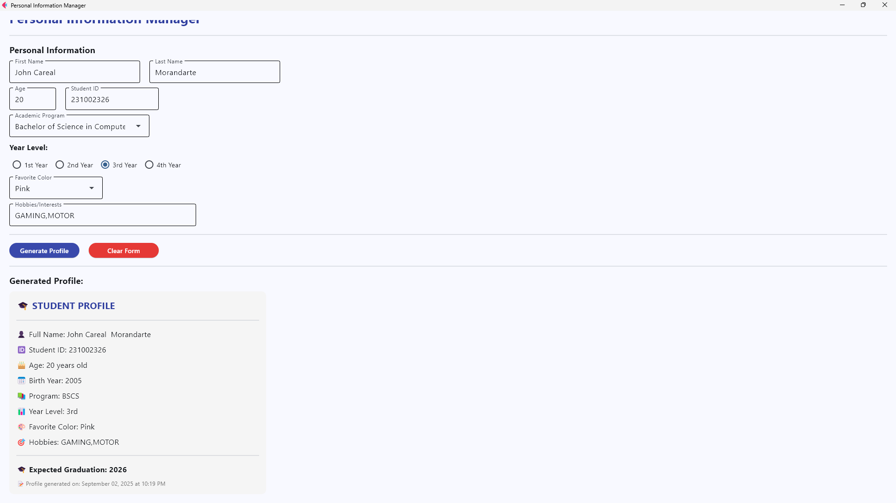

# Lab 2 Report: Git Version Control and Flet GUI Development

**Student Name:** John Careal T. Morandarte \
**Student ID:** 231002326\
**Section:** 3-A \
**Date:** 09/02/25 

## Git Configuration

### Repository Setup
- **GitHub Repository:** [\[Your repository URL\]](https://github.com/cjayputi31/cccs106-projects)
- **Local Repository:** ✅ Initialized and connected
- **Commit History:** [Number] commits with descriptive messages

### Git Skills Demonstrated
- ✅ Repository initialization and configuration
- ✅ Adding, committing, and pushing changes
- ✅ Branch creation and merging
- ✅ Remote repository management

## Flet GUI Applications

### 1. hello_flet.py
- **Status:** ✅ Completed
- **Features:** Interactive greeting, student info display, dialog boxes
- **UI Components:** Text, TextField, Buttons, Dialog, Containers
- **Notes:** It is very simple but it is useful 
### 2. personal_info_gui.py
- **Status:** ✅ Completed
- **Features:** Form inputs, dropdowns, radio buttons, profile generation
- **UI Components:** TextField, Dropdown, RadioGroup, Containers, Scrolling
- **Error Handling:** Input validation and user feedback
- **Notes:** It can be useful for knowing individuals personal information

## Technical Skills Developed

### Git Version Control
- Understanding of repository concepts
- Basic Git workflow (add, commit, push)
- Branch management and merging
- Remote repository collaboration

### Flet GUI Development
- Flet 0.28.3 syntax and components
- Page configuration and layout management
- Event handling and user interaction
- Modern UI design principles

## Challenges and Solutions
to be honest it doesn't have much difficulties, because we just need to copy then paste it

## Learning Outcomes
I learned that version control helps track changes efficiently, GUI development makes programs more user-friendly, and collaborative programming improves teamwork and project management.

## Screenshots

### Git Repository
- [ ] GitHub repository with commit history
- [ ] Local git log showing commits

### GUI Applications
- [ ] hello_flet.py running with all features
- [ ] personal_info_gui.py with filled form and generated profile

## Future Enhancements
I think the application is good and need a little more improvements, but it is already good